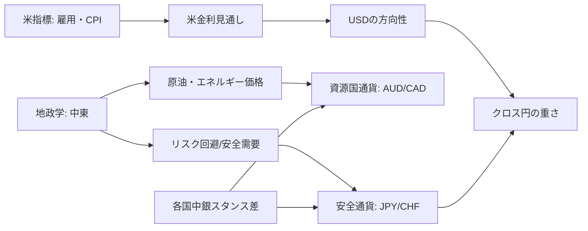

# 本日の主要通貨FX見通しレポート

## エグゼクティブサマリー

本レポートの「最新レート」は、日中のリアルタイム・スポットではなく、**欧州中央銀行（ECB）のユーロ参考為替レート（Euro foreign exchange reference rates）を基礎にした“日次参照レート”**を採用した。これは欧州域内中央銀行の協議に基づく日次の参照値で、日中の市場変動を連続的に反映するタイプではない点に留意が必要である。citeturn16search3

直近（2026-02-11 の参照レート）では、**円高（=対ドル・対ユーロ・対ポンドなどで円が相対的に強い）**が目立つ一方、**対ドルでは豪ドル・NZドルなど高ベータ通貨が上昇（=ドル安）**しやすい地合いが観測された（後述の1週間推移チャート参照）。この「円高 + 対ドルで高ベータ堅調」という一見ねじれた構図は、(1) 米国データの強弱、(2) リスク選好/回避の揺れ、(3) 日本側の政策・需給/政治要因、(4) 各国金融政策の相対スタンス（特に豪州）を同時に織り込む局面で起きやすい。citeturn13news40turn13news37turn9news39turn12search1

マクロ面では、米国は利下げ局面に入りつつも**政策金利は当面据え置き（3.50–3.75%）**というスタンスを維持しており、雇用指標の上振れは「早期利下げ期待」を後退させやすい。citeturn11view1turn13news40　一方、欧州は政策金利（預金ファシリティ）**2.00%で据え置き**を継続し、インフレはフラッシュで**1.7%**へ低下している（ただしECBはデータ依存を強調）。citeturn12search0turn24search12　日本は政策金利（無担保コール翌日物）**0.75%程度**を維持しつつ、委員会内でも見通しの分布が残る状況で、円相場は政策や当局姿勢を含むニュース感応度が高い。citeturn12search1turn13news42

短期（当日〜1週間）の戦略としては、**「円高トレンド追随」か「対ドルで高ベータの行き過ぎ調整」か**が主軸になる。テクニカル的には、対ドルで豪ドル・NZドルなどが短期RSIで“過熱”を示唆しやすく、押し目/戻り売りの時間軸設計が重要となる（詳細は各通貨節）。本レポートでは、ベースシナリオを「高頻度の米指標を見ながら、円高圧力が残りやすいが、高ベータは相対金利（豪州）とリスク心理で底堅い」と置き、上振れ/下振れのトリガーを明示する。citeturn20search20turn13news40turn9news39turn16search3

## データと算出方法

本レポートの為替レートは、entity["organization","European Central Bank","central bank | euro area"]の「ユーロ参考為替レート」を、entity["organization","Národná banka Slovenska","central bank | bratislava, slovakia"]が公開するファイル（PDF）から取得した。参照レートは通常、**14:15 CET頃の協議**に基づき、**16:00 CET頃に更新（TARGET休業日等を除く）**され、すべて**EURを基準通貨**として提示される。citeturn16search3

- 本日（JST 2026-02-12）時点の最新参照レート：**2026-02-11（EUR建て）**citeturn7view0  
- 前日比の比較対象：**2026-02-10（EUR建て）**citeturn7view2  
- テクニカル算出（移動平均・RSI・レンジ・相関）は、**2026-02-02〜2026-02-11**の参照レート系列で算出（週次の簡易レンジ/モメンタム把握が目的）。citeturn7view1turn19view0turn19view1turn19view2turn19view3turn19view4turn7view2turn7view0

**クロスレートの算出**  
参照レートは「1 EUR = x 通貨」で与えられるため、たとえば **USD/JPY** は  
USD/JPY = (EUR/JPY) ÷ (EUR/USD)  
で算出した（他通貨も同様にEURを媒介してUSD建て/JPY建てを計算）。citeturn7view0turn7view2

**データ時刻（共通）**  
最新レート（2026-02-11）は、概ね **14:15 CET（= 22:15 JST）時点の協議レート**を基礎に、**16:00 CET前後（= 翌0:00 JST前後）に公表される枠組み**である。citeturn16search3

## 市場環境とリスク要因

為替の短期ドライバーは、(A)米金利見通し、(B)リスク選好（株・信用・ボラ）、(C)資源価格、(D)地政学、(E)各国中銀の相対スタンスに大別できる。直近トピックとしては以下の寄与が大きい。

米国では雇用統計の上振れが報じられ、利下げ織り込みを後退させやすい。実際、米雇用データを受けてドルが主要通貨に対して強含んだとの市場報道がある。citeturn13news40turn20news45　一方で、FRBは直近会合で政策金利レンジを**3.50–3.75%に据え置き**、不確実性の高さとデータ依存を強調した。citeturn11view1

資源面では、米・イラン情勢など中東リスクが意識され、原油が上昇（WTI終値 **$64.63**、Brent **$69.40** など）した。citeturn13news37　この局面では資源国通貨（CAD、AUD）やリスク通貨のボラが上がりやすい一方、地政学が強まると安全通貨（JPY、CHF）需要も同時に入りやすいという、方向性が一枚岩になりにくい特徴がある（“リスク要因の種類”によって通貨反応が変化する）。citeturn13news37turn13news40

貴金属では、強い米雇用にもかかわらず金が上昇し、地政学・景気不確実性を背景に「長期の保険需要」が底流として残っていることが示唆される。citeturn13news38　このタイプの環境は、ボラ上昇局面での円・スイスフランと、リスク通貨の短期反発が同居しやすい。

日本要因では、政治・財政観測と円相場の連動が意識されやすい局面が続き、円は対主要通貨で反応的になりやすい。citeturn13news42turn13search7

## 主要レート一覧と短期チャート

以下は「2026-02-11（最新） vs 2026-02-10（前日）」の参照レートを基に、EUR媒介で算出した対USD・対JPYのクロスである（データ時刻は前節参照）。citeturn7view0turn7view2turn16search3

|通貨|対JPY（1通貨=JPY）|前日比|1週騰落|対USD（1通貨=USD）|前日比|1週騰落|
|---|---:|---:|---:|---:|---:|---:|
|USD|153.605|-1.524 (-0.98%)|-0.94%|1.0000|+0.000000 (+0.00%)|+0.00%|
|EUR|182.790|-1.720 (-0.93%)|-0.44%|1.1900|+0.000600 (+0.05%)|+0.51%|
|JPY|1.000|+0.000 (+0.00%)|+0.00%|0.006510|+0.000064 (+0.99%)|+0.95%|
|GBP|210.128|-2.075 (-0.98%)|-0.91%|1.3680|+0.000061 (+0.00%)|+0.03%|
|AUD|109.213|-0.418 (-0.38%)|+1.38%|0.71100|+0.004285 (+0.61%)|+2.34%|
|NZD|93.084|-0.637 (-0.68%)|-0.09%|0.60600|+0.001844 (+0.31%)|+0.85%|
|CAD|113.267|-1.045 (-0.91%)|-0.32%|0.73739|+0.000509 (+0.07%)|+0.63%|
|CHF|200.077|-2.170 (-1.07%)|+0.25%|1.3025|-0.001198 (-0.09%)|+1.20%|
|CNY|22.225|-0.209 (-0.93%)|-0.48%|0.14469|+0.000073 (+0.05%)|+0.46%|

上の推移は参照レートベースではあるが、直近1週間の相対パフォーマンスとしては、**対USDでAUDが強く、対JPYではJPY高が支配的**という構図が視覚的に確認できる（チャート：指数=100、2026-02-02起点）。citeturn7view1turn7view0

## 通貨別詳細分析

以下、各通貨について（1）レート・前日比、（2）直近イベント・金融政策、（3）市場センチメント/リスク、（4）テクニカル、（5）総合見通し（強気・中立・弱気）とシナリオ、（6）トレード示唆をまとめる。レートはすべてECB参照レート（EUR建て）からのクロス算出である。citeturn7view0turn7view2turn16search3

**USD（米ドル）**  
データ時刻：ECB参照レート（2026-02-11、14:15 CET協議→16:00 CET頃公表）。citeturn16search3

|ペア|最新|前日比|5日MA|RSI(7)|1週レンジ|
|---|---:|---:|---:|---:|---:|
|USD/JPY|153.605|-1.524 (-0.98%)|155.783|47.7|153.605–157.088|
|USD/USD|1.0000|+0.000000 (+0.00%)|1.0000|—|1.0000–1.0000|

直近イベント・政策要点（米ドル）  
米国の金融政策面では、entity["organization","Federal Reserve","us central bank"]が政策金利（FF金利誘導目標）を**3.50–3.75%に据え置き**、「不確実性は高い」「データを評価しつつ判断」という枠組みを維持した。citeturn11view1  
景気・指標面では、米雇用統計を受けてドルが反応しやすい。報道例として、米雇用は**+130k**（予想+70k）、失業率**4.3%**（予想4.4%）といったサプライズが伝えられている。citeturn13news40turn20news42

センチメント/リスク（米ドル）  
米金利見通しは「利下げの有無」より**利下げ開始時期・回数**が焦点で、強い雇用やインフレ再加速の兆候はドル高要因になりやすい。一方、地政学リスク（中東）による原油上昇は、リスク回避のドル高と、資源国通貨高の双方を同時に誘発し得るため、ドルの方向性を単純化しにくい。citeturn13news37turn13news40  
次の重要イベントとして、米CPI（1月分）が**2026-02-13 8:30AM ET**に予定されている。citeturn20search20　市場予想として、前年同月比・コアとも**2.5%**程度への低下が見込まれるとの整理がある（サーベイベース）。citeturn20news41

テクニカル（米ドル）  
USD/JPYは5日騰落でマイナス、RSI(7)は中立圏。レンジ下限（1週安値）が目前にあり、**ブレイクすると下値追随が出やすい一方、割れなければ短期リバウンド**が起きやすい形状。

総合見通し（米ドル）：**中立（対円は弱気寄り）**  
- 根拠：米指標はドルの下支え要因だが、直近の参照レート群では円高圧力が勝ち、USD/JPYはレンジ下限を試す構図。citeturn13news40turn12search1turn7view0  
- ベース：米CPIが「概ね予想通り」で、USD/JPYは下限〜5日MAの範囲で往来。citeturn20search20turn20news41  
- 上振れ（ドル高）：米CPIが上振れ、短期金利見通しがタイト化。  
- 下振れ（ドル安/円高）：米CPI下振れ + 日本側金利正常化観測/円買いが重なる。

トレード示唆（米ドル）  
短期：USD/JPYは「レンジ下限での反発狙い」よりも、**下限割れ確認後の順張り**がリスクリワードを作りやすい（日次参照では下限=1週安値近辺）。損切りはブレイク失敗時（再びレンジ内）に置き、利確は直近戻り高値/5日MA付近を第1目標とする（概ねR:R 1:1.5〜2）。  
中期：米CPIと米金利見通しの方向性が固まるまで、過度なレバレッジを避け「イベント跨ぎのガンマ（変動）リスク」を管理するのが合理的。citeturn20search20

**EUR（ユーロ）**  
データ時刻：同上。citeturn16search3

|ペア|最新|前日比|5日MA|RSI(7)|1週レンジ|
|---|---:|---:|---:|---:|---:|
|EUR/JPY|182.790|-1.720 (-0.93%)|184.666|40.7|182.790–185.650|
|EUR/USD|1.1900|+0.000600 (+0.05%)|1.1854|42.1|1.1794–1.1900|

直近イベント・政策要点（ユーロ）  
entity["organization","Eurostat","eu statistical office | luxembourg"]のフラッシュ推計では、ユーロ圏インフレ（HICP）は**1.7%（1月）**とされ、12月の2.0%から低下している。citeturn24search12  
金融政策ではECBが主要政策金利を据え置き、預金ファシリティ**2.00%**を継続した。citeturn12search0　GDP面では、2025年Q4のユーロ圏GDPは前期比**+0.3%**とされる（フラッシュ）。citeturn21search3　市場コンセンサス比では、GDPの「予想0.2%に対し0.3%」といった上振れが示されている。citeturn22view0turn22view1

センチメント/リスク（ユーロ）  
インフレが目標近傍に低下する一方、ECBは据え置きで、ユーロは「成長の底堅さ」と「インフレ低下」を同時に織り込む局面。米国側が強いとEUR/USDは下押しされやすいが、欧州側の景気底打ちや財政支出（防衛・インフラ）期待が残ると、ユーロ売りも一方向に走りにくい。citeturn12news35turn21search3turn24search12

テクニカル（ユーロ）  
EUR/USDは1週レンジ上限に接近しつつもRSI(7)=42程度で、短期モメンタムは強くない。対円ではEUR/JPYがレンジ下限に張り付き、円高圧力の影響が明確。

総合見通し（ユーロ）：**中立（対円は弱気寄り）**  
- 根拠：政策金利据え置きの一方、インフレ低下で「利上げ再開の必然性」が足元では乏しい。対円では円高の方が主導。citeturn12search0turn24search12turn7view0  
- ベース：EUR/USDはレンジ継続、EUR/JPYは円要因優位。  
- 上振れ：欧州景気指標の連続上振れ + 米CPI下振れ → EUR/USD上昇。  
- 下振れ：地政学悪化・エネルギー価格上昇が欧州の交易条件を悪化させる場合（ただし今回は原油上昇が概ね地政学起因である点に留意）。citeturn13news37turn12news35

トレード示唆（ユーロ）  
短期：EUR/JPYは**レンジ下限の割れ/割れない**で戦略を二分。割れ確認後は戻り売り、割れずに反発なら短期逆張り（ストップは下限割れ）。  
中期：EUR/USDは米CPIと欧州インフレの組み合わせで方向が出る。イベント前後はサイズを落とし、損切りは「直近1週レンジ外」基準で機械的に。citeturn20search20turn24search12

**JPY（日本円）**  
データ時刻：同上。citeturn16search3

|ペア|最新|前日比|5日MA|RSI(7)|1週レンジ|
|---|---:|---:|---:|---:|---:|
|JPY/JPY|1.000|+0.000 (+0.00%)|1.000|—|1.000–1.000|
|JPY/USD|0.006510|+0.000064 (+0.99%)|0.006420|52.4|0.006366–0.006510|

直近イベント・政策要点（円）  
entity["organization","Bank of Japan","central bank | tokyo, japan"]は直近会合で、無担保コール翌日物を**0.75%程度**に誘導する方針を**8-1で決定**し、反対票は「より高い水準（1.0%）が望ましい」とした。citeturn12search1  
また、日銀審議委員からは「基調インフレの上振れを抑えるため、適時・段階的な利上げが必要」といった趣旨の発言が報じられている。citeturn12news38  
政治・財政面でも、円安が輸入物価を通じてインフレを押し上げ得る点が意識され、政策・市場の相互作用が円相場に影響しやすい。citeturn13news42

センチメント/リスク（円）  
円は「安全通貨」要因に加え、「国内金利正常化（追加利上げ）観測」「当局の円安牽制/介入警戒」「日本の財政・政治イベント」など、多層の材料で動きやすい。日経平均や超長期国債の値動きが政治観測で振れたとの報道もあり、短期ノイズが出やすい。citeturn13search7turn13news40

テクニカル（円）  
JPY/USDは1週レンジ上限に位置し、短期的には円高が進んだ水準。USD/JPY側から見ると下値（1週安値）に張り付いているため、**ニュースで下抜けると加速しやすい**一方、イベント無風なら利食いで反発もしやすい。

総合見通し（円）：**強気（円高方向）**  
- 根拠：日銀の金利水準は既に0.75%へ引き上げられており、委員発言も「適時利上げ」を示唆。さらに政治・当局対応の不確実性が円売りを制約しやすい。citeturn12search1turn12news38turn13news42  
- ベース：円高圧力が残り、クロス円は上値が重い。  
- 上振れ（円高加速）：米CPI下振れ + 日銀タカ派発言/追加利上げ織り込み。citeturn20search20turn12news38  
- 下振れ（円安反転）：グローバル急速リスクオン（高ベータ通貨急伸）で円キャリー再開、あるいは国内イベントが無風で円買いが巻き戻る。

トレード示唆（円）  
短期：クロス円（GBP/JPY、EUR/JPY等）は、**戻り売り優位**。損切りは直近5日MA上抜け、利確は1週安値更新を目標（R:R 1:2を基本）。  
中期：日本側の政策イベント（発言/会合）と米CPIの組合せが最大のトリガーとなるため、ポジションは「イベントの前後で分割」し、ギャップリスクを管理する。citeturn12search1turn20search20

**GBP（英ポンド）**  
データ時刻：同上。citeturn16search3

|ペア|最新|前日比|5日MA|RSI(7)|1週レンジ|
|---|---:|---:|---:|---:|---:|
|GBP/JPY|210.128|-2.075 (-0.98%)|212.431|51.8|210.128–214.891|
|GBP/USD|1.3680|+0.000061 (+0.00%)|1.3637|61.1|1.3575–1.3719|

直近イベント・政策要点（ポンド）  
entity["organization","Bank of England","central bank | london, uk"]は2026年2月会合で政策金利（Bank Rate）を**3.75%に据え置き**、投票は**5–4**（4名が0.25%利下げを支持）と公表している。citeturn11view2  
英国のGDP（前年比）は、最新リリース（2025年Q3相当）で**1.3%（予想1.3%）**と掲示されている（出所：ONS）。citeturn22view2

センチメント/リスク（ポンド）  
BOEの票割れは「利下げ余地がある」シグナルでもあり、ポンドは金利先物の織り込み変化に敏感。英国側の指標が弱い場合はポンド安要因、ただし米国側の金利・ドル要因が強い局面では、GBP/USDはレンジ化しやすい。citeturn11view2turn13news40

テクニカル（ポンド）  
GBP/USDはRSI(7)=61程度でやや強め、ただし上値は1週レンジ上限が近い。対円ではGBP/JPYがレンジ下限方向で、円高の影響が前面。

総合見通し（ポンド）：**中立（対円は弱気寄り）**  
- 根拠：BOEは据え置きだが票割れで利下げ観測が残る。対円では円高圧力が優位。citeturn11view2turn12search1  
- ベース：GBP/USDは横ばい、GBP/JPYは戻り売り。  
- 上振れ：英国指標の上振れ + 米CPI下振れ。  
- 下振れ：英国指標悪化 + リスク回避（株安）でポンドが高ベータ化。

トレード示唆（ポンド）  
短期：GBP/JPYは「戻り売り」中心。ストップは直近戻り高値超え、ターゲットは1週安値更新（R:R 1:2目安）。  
中期：GBPはBOEの「利下げのテンポ」次第のため、政策会合・議事要旨の前後はサイズを半減し、勝ち負けよりも“生存性”重視で。citeturn11view2

**AUD（豪ドル）**  
データ時刻：同上。citeturn16search3

|ペア|最新|前日比|5日MA|RSI(7)|1週レンジ|
|---|---:|---:|---:|---:|---:|
|AUD/JPY|109.213|-0.418 (-0.38%)|109.643|80.0|107.728–110.224|
|AUD/USD|0.71100|+0.004285 (+0.61%)|0.70386|90.6|0.69475–0.71100|

直近イベント・政策要点（豪ドル）  
entity["organization","Reserve Bank of Australia","central bank | sydney, australia"]は政策判断で利上げを行い、豪州の金利は引き締め方向が意識されている（市場報道として0.25%利上げ）。citeturn9news39  
豪ドルは「金利差」と「リスク選好」に敏感で、原油を含むコモディティ上昇局面では支えられやすい一方、地政学ショックが強すぎるとリスク回避で売られる場合もある。citeturn13news37turn13news40

センチメント/リスク（豪ドル）  
豪ドルは直近1週間で対USDの相対上昇が目立つ。これは(1)RBAのタカ派方向、(2)リスク選好の回復局面、(3)ドルの材料出尽くし、のいずれか、または複合で説明できる。citeturn9news39turn13news40  
ただし、短期RSIが高水準で、短期的には利食い・調整入りやすい。

テクニカル（豪ドル）  
AUD/USDはRSI(7)=90台で“過熱”を示唆、レンジ上限付近。AUD/JPYもRSIが高く、円高局面では上値が抑えられやすい。

総合見通し（豪ドル）：**対USDは強気（短期は過熱に注意）、対円は中立**  
- 根拠：RBAの相対タカ派が支え。一方で円高がクロスの上値を抑制。citeturn9news39turn12search1  
- ベース：対USDは高値圏維持→押し目形成。  
- 上振れ：リスクオン継続（株高）+ 米CPI下振れ。citeturn20search20  
- 下振れ：地政学悪化でリスク回避が優勢（高ベータ売り）。citeturn13news37

トレード示唆（豪ドル）  
短期：AUD/USDは**ブレイクアウト追随より「押し目待ち」**が合理的。損切りは5日MA割れ、利確は1週高値更新で段階利確（R:R 1:1.5〜2）。  
中期：RBAがタカ派を維持する限り基調は支えられやすいが、過熱局面は「サイズを落として継続保有（トレーリング）」が有効。

**NZD（NZドル）**  
データ時刻：同上。citeturn16search3

|ペア|最新|前日比|5日MA|RSI(7)|1週レンジ|
|---|---:|---:|---:|---:|---:|
|NZD/JPY|93.084|-0.637 (-0.68%)|93.874|69.4|93.084–94.455|
|NZD/USD|0.60600|+0.001844 (+0.31%)|0.60262|85.6|0.59950–0.60600|

直近イベント・政策要点（NZドル）  
entity["organization","Reserve Bank of New Zealand","central bank | wellington, nz"]は直近（2025-11-26）でOCRを**2.25%へ引き下げ**、インフレが2%近辺に戻る見通し等を示している。citeturn10search2  
今後のイベントとして、RBNZは**2026-02-17（火）17:00–19:00**に「Monetary Policy Statement and OCR」を予定している（NZ時間表記）。citeturn10search26

センチメント/リスク（NZドル）  
政策金利は既に緩和方向にあり、NZDは「利下げ局面の通貨」として見られやすい一方、豪ドルと同じくリスク選好で短期反発しやすい。RBNZイベント前はポジションが偏りやすく、ブレが出やすい。citeturn10search2turn10search26

テクニカル（NZドル）  
NZD/USDはRSI高水準で短期過熱気味。対円ではNZD/JPYがレンジ下限方向で、円高が上値を抑える。

総合見通し（NZドル）：**中立（対USDは短期強気、イベント前で不安定）**  
- ベース：RBNZを前に様子見、対円は弱含み。  
- 上振れ：RBNZが想定以上にタカ派（利下げ休止/将来の再利上げ含意）。  
- 下振れ：RBNZがハト派（追加利下げ示唆）+ リスクオフ。citeturn10search26turn13news37

トレード示唆（NZドル）  
短期：イベント前は「小さく、短く」。NZD/USDは高値追いより押し目待ち、ストップは5日MA割れ。  
中期：RBNZのガイダンスが緩和継続なら、NZDは戻り売り優位になりやすい。

**CAD（カナダドル）**  
データ時刻：同上。citeturn16search3

|ペア|最新|前日比|5日MA|RSI(7)|1週レンジ|
|---|---:|---:|---:|---:|---:|
|CAD/JPY|113.267|-1.045 (-0.91%)|114.394|53.3|113.267–114.946|
|CAD/USD|0.73739|+0.000509 (+0.07%)|0.73434|68.2|0.73080–0.73739|

直近イベント・政策要点（カナダドル）  
entity["organization","Bank of Canada","central bank | ottawa, canada"]は政策金利（オーバーナイト）を**2.25%に据え置き**、不確実性（米通商政策・地政学）を強調している。citeturn11view3  
カナダドルは原油と連動しやすく、WTIが上昇した局面では下支えになり得る。citeturn13news37　ただし、強い米雇用データでドル高圧力がかかると、原油高を相殺してCADが伸び悩む場面が報じられている。citeturn10news40

センチメント/リスク（カナダドル）  
CADは「原油高=追い風」だが、同時に「ドル高=逆風」が来ると相殺されやすい。さらに北米通商枠組み（USMCA見直し等）リスクは、カナダのリスクプレミアム要因。citeturn10news39turn11view3

テクニカル（カナダドル）  
CAD/USDはレンジ上限に接近しつつRSIはやや強め。CAD/JPYは円高圧力で下向きの角度が残る。

総合見通し（カナダドル）：**中立（対円は弱気寄り）**  
- ベース：原油高が下支えするが、ドル高圧力と綱引き。citeturn13news37turn13news40  
- 上振れ：原油続伸 + 米金利低下。  
- 下振れ：原油反落 + 米ドル高が加速（米CPI上振れ等）。citeturn20search20turn13news37

トレード示唆（カナダドル）  
短期：CAD/JPYは戻り売り、CAD/USDは押し目買い/戻り売りの両建て的（レンジ戦略）になりやすい。  
中期：原油と米金利の両睨み。原油に張るなら、地政学ヘッドラインの急変（急落）に備え、ストップを必ず置く。citeturn13news37

**CHF（スイスフラン）**  
データ時刻：同上。citeturn16search3

|ペア|最新|前日比|5日MA|RSI(7)|1週レンジ|
|---|---:|---:|---:|---:|---:|
|CHF/JPY|200.077|-2.170 (-1.07%)|201.842|58.8|199.576–202.896|
|CHF/USD|1.3025|-0.001198 (-0.09%)|1.2957|74.8|1.2854–1.3037|

直近イベント・政策要点（スイスフラン）  
entity["organization","Swiss National Bank","central bank | bern, switzerland"]は政策金利を**0%に据え置き**、必要に応じて為替市場で行動する姿勢（介入の可能性）を明示している。citeturn12search2  
市場報道では、米雇用統計後にドルがスイスフランに対して上昇といった反応も観測される。citeturn13news40

センチメント/リスク（スイスフラン）  
CHFは安全通貨として買われる一方、SNBが過度なフラン高を嫌う局面では「介入警戒」が上値を抑え得る。地政学リスクの高まりはCHF買い要因になりやすい。citeturn12search2turn13news37

テクニカル（スイスフラン）  
CHF/USDはレンジ上限近辺、RSIは強め。対円ではCHF/JPYが下押し（円高）されやすいが、レンジとしてはまだ中域。

総合見通し（スイスフラン）：**中立（対ドルはやや強気、対円は中立〜弱気）**  
- ベース：リスクイベントでCHF需要は底堅いが、SNBの姿勢が上値を制約。citeturn12search2turn13news37  
- 上振れ：地政学の深刻化（安全通貨買い）。  
- 下振れ：リスクオン強まり + SNBが口先介入を強める。

トレード示唆（スイスフラン）  
短期：CHF/USDは高値追いより押し目待ち。CHF/JPYは円高局面では戻り売りの方が分が良い。  
中期：ヘッドライン・リスクが大きいため、ポジションは小さく、ストップは必須。

**CNY（中国人民元）**  
データ時刻：同上。citeturn16search3

|ペア|最新|前日比|5日MA|RSI(7)|1週レンジ|
|---|---:|---:|---:|---:|---:|
|CNY/JPY|22.225|-0.209 (-0.93%)|22.494|54.7|22.225–22.639|
|CNY/USD|0.14469|+0.000073 (+0.05%)|0.14440|95.9|0.14402–0.14469|

直近イベント・政策要点（人民元）  
entity["organization","People's Bank of China","central bank | beijing, china"]は（報道ベースで）内需拡大に向けた金融支援を強める方針を示し、供給過剰・需要不足の課題に言及している。citeturn10news44　また、年内のRRRや金利引き下げに言及したとも報じられている。citeturn10search7  
マクロ指標としては、中国の1月CPIは前年比**0.2%（予想0.4%）**、PPIは前年比**-1.4%（予想-1.5%）**と掲示されている。citeturn25view0

センチメント/リスク（人民元）  
人民元は「政策運営（緩和バイアス）」と「対外環境（貿易・地政学・ドル）」の綱引き。内需刺激を優先するほど金利差面で人民元の上値は重くなりやすい一方、安定重視のスタンスも繰り返し示されているため、急変は政策サプライズや外部ショックに依存しやすい。citeturn10news44turn10search7

テクニカル（人民元）  
CNY/USDは小幅ながら上昇が連続しRSIは極端に高く出ているが、参照レートの小さな日次変化に依存するため「シグナル強度」は過大評価しない方がよい。CNY/JPYは円高で押されやすい。

総合見通し（人民元）：**中立（対円は弱気寄り）**  
- ベース：緩和姿勢と安定重視の併存でレンジ化。citeturn10news44turn10search7  
- 上振れ：内需指標改善・政策の安定志向強化。  
- 下振れ：緩和加速 + ドル高（米CPI上振れ等）。citeturn20search20

トレード示唆（人民元）  
短期：CNYはボラが相対的に低く、短期で大きな損益を狙う設計は難しい。やるなら「狭いストップ + 小さめの利幅」を前提に。  
中期：政策メッセージの変化（緩和の強弱）と、米国イベント（CPI等）に連動しやすい。ポジションは“材料待ち”で抑制するのが無難。

## 相関・シナリオとトレード示唆の統合

相関（短期）  
直近1週間（参照レート日次変化）の「対USDリターン相関」をみると、**AUDとNZDの相関が高い**一方、**EURとCHF、EURとCAD**も相関が高い。サンプルが少ないため統計的な頑健性には限界があるが、リスクオン局面では豪ドル・NZドルが同方向に動きやすいという直感と整合的である（下表は日次%変化同士の相関）。citeturn7view1turn7view0

|      | EUR | JPY | GBP | AUD | NZD | CAD | CHF | CNY |
|---|---:|---:|---:|---:|---:|---:|---:|---:|
|EUR|1.00|0.46|0.59|0.41|0.44|0.83|0.90|0.63|
|JPY|0.46|1.00|0.22|0.21|0.34|0.59|0.35|0.54|
|GBP|0.59|0.22|1.00|0.85|0.73|0.79|0.57|0.34|
|AUD|0.41|0.21|0.85|1.00|0.95|0.57|0.45|0.47|
|NZD|0.44|0.34|0.73|0.95|1.00|0.60|0.52|0.69|
|CAD|0.83|0.59|0.79|0.57|0.60|1.00|0.79|0.67|
|CHF|0.90|0.35|0.57|0.45|0.52|0.79|1.00|0.78|
|CNY|0.63|0.54|0.34|0.47|0.69|0.67|0.78|1.00|

短期相関フロー（概念図）  


シナリオツリー（当日〜翌週のベース/上下）  
（主要トリガー：米CPI、地政学ヘッドライン、日本の政策・当局対応観測）citeturn20search20turn13news37turn12search1
```mermaid
flowchart TD
  S[市場ベース: 円高圧力は残る / 対USDで高ベータ堅調] --> T1{米CPI(1月)は?}
  T1 -->|概ね予想| Base[ベース: USD/JPYは下限付近でレンジ\nAUD/USDは高値圏で押し目]
  T1 -->|上振れ| UpUSD[上振れ: 米金利上昇→USD高\n高ベータは調整]
  T1 -->|下振れ| DownUSD[下振れ: USD安→円高加速\nクロス円は戻り売り優勢]
  Base --> Geo{中東リスクは?}
  UpUSD --> Geo
  DownUSD --> Geo
  Geo -->|沈静化| RiskOn[リスクオン: AUD/NZD/CADが相対優位]
  Geo -->|激化| RiskOff[リスクオフ: JPY/CHF優位\n高ベータは下落]
```

ポートフォリオ/リスク管理の要点（総括）  
- **円高トレンド**と**対ドルでの高ベータ上昇**が同居しているため、「対円」「対ドル」で戦略を分けるのが合理的。参照レートベースでは、クロス円の下押しが目立つ一方、AUD/USDなどは短期過熱が示唆される。citeturn7view0turn7view1  
- イベント（米CPI、RBNZなど）前は、ポジションを分割し「損切りの明確化（レンジ外）」を徹底する。citeturn20search20turn10search26  
- 地政学発の原油上昇はCAD/AUDの追い風になり得るが、同時にリスク回避でJPY/CHFが買われる経路もあるため、単一テーマでの過度な集中を避ける。citeturn13news37turn13news40